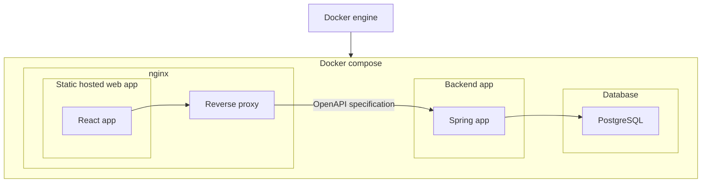

# Application architecture

```mermaid
flowchart TB

    docker[Docker engine]

    docker --> compose

    subgraph compose[Docker compose]
        direction LR

        subgraph nginx
            direction TB

            subgraph static[Static hosted web app]
                react_app[React app]
            end

            react_app --> reverse_proxy

            reverse_proxy[Reverse proxy]
        end

        subgraph backend[Backend app]
            spring_app[Spring app]
        end

        subgraph database[Database]
            postgres[PostgreSQL]
        end

        nginx ~~~ backend
        backend ~~~ database

        reverse_proxy -- OpenAPI specification --> spring_app
        spring_app --> postgres

    end

```