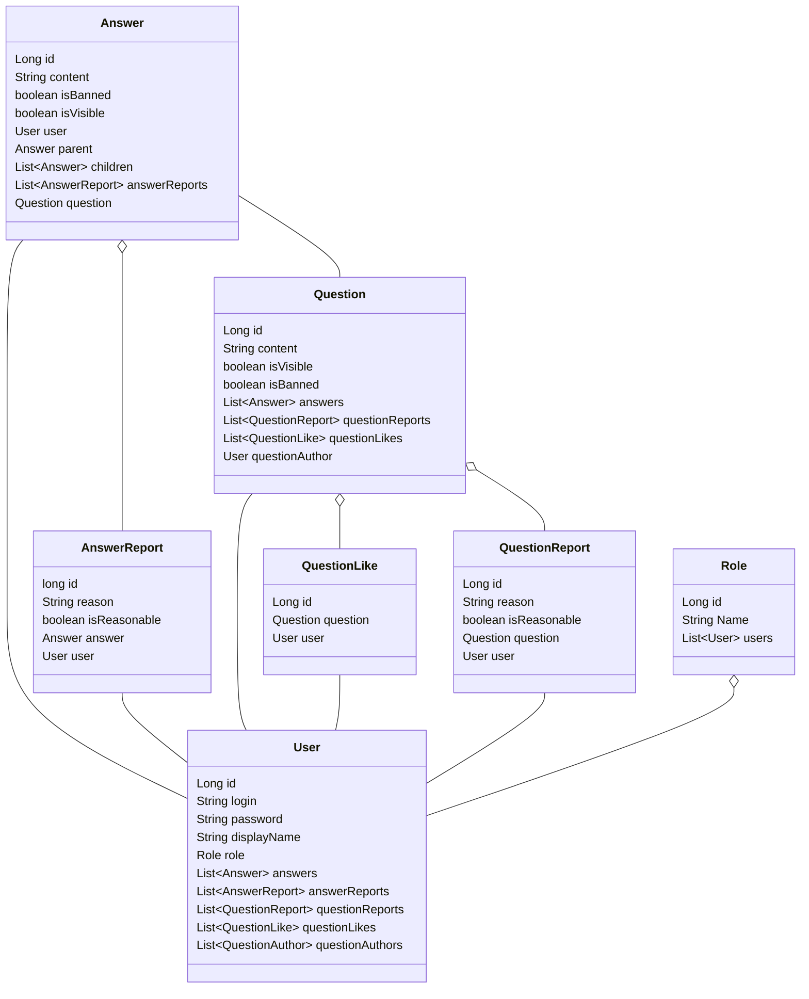

# Class diagram

```mermaid
classDiagram
    class Answer {
        Long id
        String content
        boolean isBanned
        boolean isVisible
        User user
        Answer parent
        List~Answer~ children
        List~AnswerReport~ answerReports
        Question question
    }

    %% Answer o-- Answer
    Answer -- User
    Answer o-- AnswerReport
    Answer -- Question

    class AnswerReport {
        long id
        String reason
        boolean isReasonable
        Answer answer
        User user
    }

    AnswerReport -- User

    class Question {
        Long id
        String content
        boolean isVisible
        boolean isBanned
        List~Answer~ answers
        List~QuestionReport~ questionReports
        List~QuestionLike~ questionLikes
        User questionAuthor
    }

    Question o-- QuestionReport
    Question o-- QuestionLike
    Question -- User
    
    %% class QuestionAuthor {
    %%     Long id
    %%     User user
    %%     Question question
    %% }

    class QuestionLike {
        Long id
        Question question
        User user
    }

    QuestionLike -- User

    class QuestionReport {
        Long id
        String reason
        boolean isReasonable
        Question question
        User user
    }

    QuestionReport -- User

    class Role {
        Long id
        String Name
        List~User~ users
    }

    Role o-- User

    class User {
        Long id
        String login
        String password
        String displayName
        Role role
        List~Answer~ answers
        List~AnswerReport~ answerReports
        List~QuestionReport~ questionReports
        List~QuestionLike~ questionLikes
        List~QuestionAuthor~ questionAuthors
    }

```